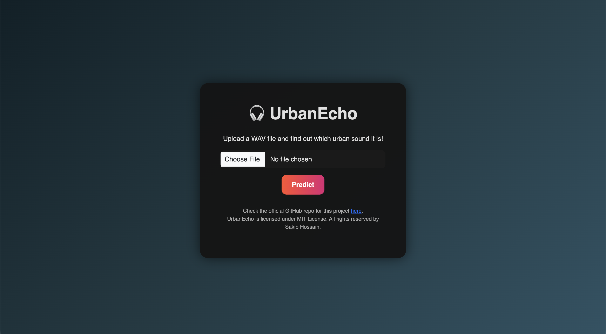
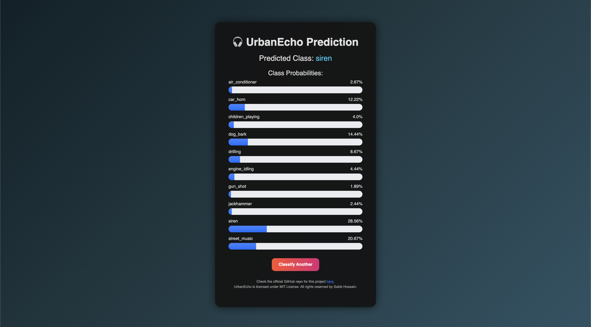

# 💥 UrbanEcho

UrbanEcho is a web-based audio classification project that predicts urban sound types from `.wav` files. It is built with **Python, scikit-learn, and Flask**, and uses a **RandomizedSearchCV-tuned ML pipeline** trained on tabular audio features extracted from the UrbanSound8K dataset.

---

## 🚀 Features

- Accepts `.wav` audio file uploads via a simple web interface.
- Extracts 34 audio features per sample (MFCCs, Chroma, Spectral Contrast, Zero Crossing Rate, Spectral Centroid).
- Predicts **10 classes** of urban sounds:
  - air_conditioner
  - car_horn
  - children_playing
  - dog_bark
  - drilling
  - engine_idling
  - gun_shot
  - jackhammer
  - siren
  - street_music
- Displays predicted class with **class probabilities** using visual progress bars.
- Automatically cleans uploaded files after prediction.
- Self-healing: if model files are missing, it retrains the pipeline automatically.

---

## 🖼 Screenshots

**Upload Page:**  
  

**Prediction Result Page:**  
  

---

## 📁 Project Structure

```
UrbanEcho/
├── datasets/                         # Datasets used for training
│ └── extracted_audio_features.csv
├── models/                           # .pkl files go here
│ ├── feature_names.pkl               # Not included with the repo
│ └── pipe.pkl                        # Not included with the repo
├── static/                           # Static files for the web app
│ └── uploads/   
│ └── style.css
├── templates/                        # HTML code for front-end
│ ├── index.html
│ └── result.html
├── utils/                            # Utility code for feature engineering
│ └── feature_extractor.py
├── app.py                            # Flask app
├── fit.py                            # Python script for training the model
├── requirements.txt                  # Libraries required for this project
└── research.ipynb                    # Notebook used for testing, visualization and many more
```


---

## 🗂 Dataset

- Source: [UrbanSound8K Tabular Form](https://www.kaggle.com/datasets/orvile/urban-sound-8k-tabular-form)  
- Contains audio features extracted from real-world urban sounds.
- 34 features per sample:
  - MFCC_1 … MFCC_13
  - Chroma_1 … Chroma_12
  - SpectralContrast_1 … SpectralContrast_7
  - ZeroCrossingRate
  - SpectralCentroid
- 10 classes of urban sound.

---

## ⚙ Installation

1. Clone the repository:
```bash
git clone https://github.com/yourusername/UrbanEcho.git
cd UrbanEcho
```

2. Install dependencies:
```bash
pip install -r requirements.txt
```
3. Run the Web App:
```bash
python app.py
```

---

## 🏃 How to use
1. After running the app, open your browser and go to [localhost:5000](http://127.0.0.1:5000/)
2. The interface should appear instantly. Upload a `.wav` file and hit **Predict**
3. The app will display: 
   - Predicted class (human-readable label)
   - Probabilities for all classes in a progress-bar style visualization.

---

## 🐳 Run the app directly via Dockerhub Image
This is my first project where I have implemented Docker containerization. I have created a [**Dockerhub repository**](https://hub.docker.com/r/bytebard101/urbanecho) where I have pushed the docker container. 

The container is built on both ARM64 and AMD64 architectures, so that it can run on almost all major computers. You can run the app easily by using the Dockerhub Image. Here's how you can do it:
1. Install [Docker Desktop](https://www.docker.com/products/docker-desktop/) and sign-in
  
2. Open Terminal and run this:
```bash
docker pull bytebard101/urbanecho:latest
docker run --rm -p 5000:5000 bytebard101/urbanecho:latest
```
3. If your machine does not have the `port 5000` free, you need to run in a different port. Try to run this:
```bash
docker run --rm -p 5001:5000 bytebard101/urbanecho:latest
```
> If you followed Step 2 and the command ran successfully, then **DO NOT** follow this step.
4. The app will be live at localhost:5000. Open your browser and navigate to [http://127.0.0.1:5000](http://127.0.0.1:5000/) (or [http://127.0.0.1:5001](http://127.0.0.1:5000/) if you followed Step 3).

Check [Docker Documentation](https://docs.docker.com/) to learn more about Docker and it's commands.

---

## 📊 Model Performance

- **Algorithm**: RandomForest (RandomizedSearchCV tuned)  
- **Cross-validated F1-score**: 0.91  

**Classification report on test set:**

| Class | Precision | Recall | F1-score | Support |
|-------|-----------|--------|----------|--------|
| 0 (air_conditioner)     | 0.94 | 0.97 | 0.96 | 334 |
| 1 (car_horn)            | 0.91 | 0.83 | 0.87 | 143 |
| 2 (children_playing)    | 0.80 | 0.87 | 0.84 | 328 |
| 3 (dog_bark)            | 0.88 | 0.84 | 0.86 | 326 |
| 4 (drilling)            | 0.94 | 0.91 | 0.93 | 333 |
| 5 (engine_idling)       | 0.95 | 0.95 | 0.95 | 333 |
| 6 (gun_shot)            | 0.99 | 0.84 | 0.91 | 125 |
| 7 (jackhammer)          | 0.91 | 0.99 | 0.95 | 334 |
| 8 (siren)               | 0.94 | 0.93 | 0.94 | 307 |
| 9 (street_music)        | 0.85 | 0.83 | 0.84 | 329 |
| **Accuracy / Weighted avg** | 0.91 | 0.91 | 0.91 | 2892 |

---

## ⚡️ Notes / Limitations
- Single `.wav` predictions can show messy probabilities due to PCA and class overlap.
  
- Model is trained on `tabular features`, not raw audio — deep learning could improve predictions significantly.
- If `models/pipe.pkl` or `models/feature_names.pkl` are deleted, the app will retrain the model automatically (may take a few minutes).
- Because of the lack of extra contributors and my lack of front-end expertise, I had to use AI tools (mostly LLM services like ChatGPT™, Grok™, Gemini™) in order to create a sophisticated front end for the web app. The `HTML` and `CSS` were written by those tools.
- The `static/style.css` file is currently blank. I have used `<style/>` tag and inline method in HTML files to generate the style. It will be updated in future if needed.

---

## 📌 Author
Sakib ( ByteBard58 )

> Student | Aspiring Computer Engineer | AI & ML Enthusiast

📍 GitHub Profile: [ByteBard58](http://www.github.com/ByteBard58)

---

## 😃 Appreciation 
Thank you for taking the time to review my work. I hope you enjoyed it and found it intriguing. It would mean a lot to me if you could star it on GitHub. 🌟 If you would like to contribute to this repository, please do so. It will be a great help!

If you have any questions, suggestions, or anything else you’d like to discuss, please don’t hesitate to reach out. You can find my contact information on my [GitHub profile page](http://www.github.com/ByteBard58). I’m all ears! 😊

**Have a great day!**
